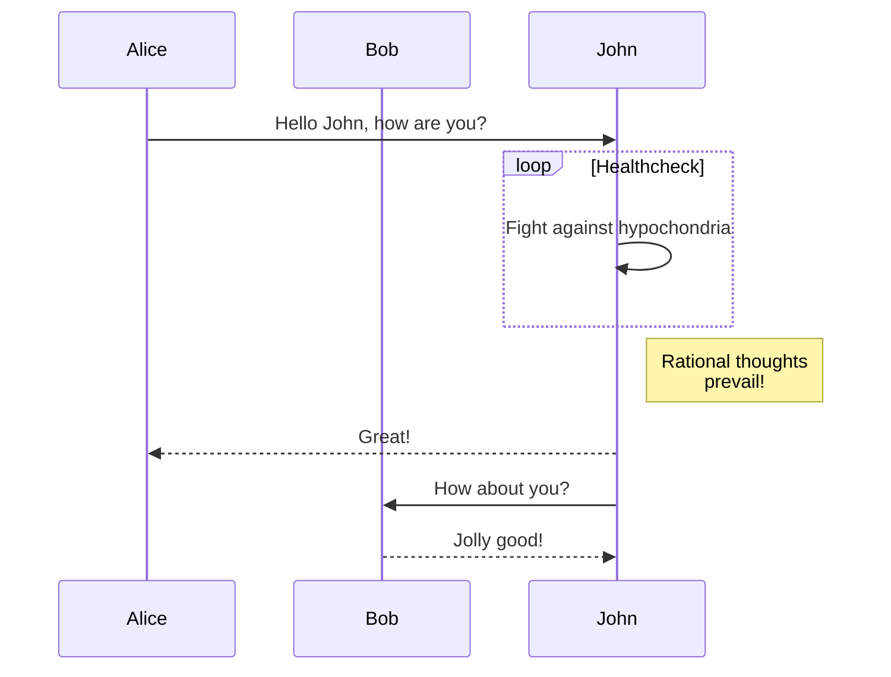

+++
title = "图表"
linkTitle = "图表"
description = "在内容中用围栏代码块与渲染钩子插入图表：GoAT 构建期渲染、Mermaid 浏览器端渲染，含验证方法与常见坑。"
date = 2026-10-01
weight = 190
source = "https://gohugo.io/content-management/diagrams/"

[params.teach]
difficulty = "进阶"
time = "20–30 分钟"
prereq = [
  "会写围栏代码块，知道 `layouts/_markup/` 下的渲染钩子是什么（见[渲染钩子](/render-hooks/)）。",
  "能修改基础模板（`baseof.html`），并能在产物 HTML 里核对输出。",
]
outcomes = [
  "用 `goat` 代码块画出构建期渲染的图形，且不需要任何 JavaScript；",
  "为 Mermaid 写一个代码块渲染钩子，并只在用到的页面上加载脚本；",
  "用 `width`、`color`、`class` 等属性调整 GoAT 图的样式；",
  "判断一个图表该走构建期渲染还是浏览器端渲染，并知道各自的失败表现。",
]
next = ["/render-hooks/code-blocks/", "/render-hooks/introduction/", "/content-management/markdown-attributes/"]

+++

## 这一页解决什么问题

在内容中插入图表大致有两条路线：一是构建期渲染（render at build time），由 Hugo 把图表描述直接转换成静态标记；二是浏览器端渲染（render in browser），页面先输出图表源码，再由加载的 JavaScript 库把它画出来。Hugo 对前者中的 GoAT 提供了内置支持，对 Mermaid 之类则要由站点自己编写渲染钩子（render hook）来接管。两条路线的依赖、产物与适用场景都不相同。

这一页要解决的正是「选哪条路、代码写在哪、怎么确认它真的画出来了」：

| 路线 | 代表 | 代码写在哪 | 产物里是什么 |
| --- | --- | --- | --- |
| 构建期 | `goat` 代码块 | 不用写代码，Hugo 内置 | 内联 `<svg>` |
| 浏览器端 | `mermaid` 代码块 | 自己写 `layouts/_markup/render-codeblock-mermaid.html` | `<pre class="mermaid">` + 一段脚本 |

**验证 GoAT 是否真的渲染了**：写一个 `goat` 代码块并构建，然后到产物 HTML 里搜。

```bash
hugo
```

**你应当看到什么**（**实测：Hugo 0.167**）：产物里出现

```html
<div class="goat svg-container ">
  <svg xmlns="http://www.w3.org/2000/svg" …>
```

也就是 ASCII 图被转换成了内联 SVG，**页面上不需要执行任何 JavaScript**。另外**实测**：即使站点自己写了通用的代码块渲染钩子（`layouts/_markup/render-codeblock.html`，本站的主题就有），`goat` 这个**按类型**的内置钩子仍然优先，GoAT 图照样渲染——你不需要为了 GoAT 去改通用钩子。

**验证 Mermaid 是否生效**：产物里应当能看到 `<pre class="mermaid">`，以及基础模板在 `body` 结束标签前插入的 `mermaid.initialize` 脚本；如果只有 `<pre class="mermaid">` 而没有脚本，页面上就只会剩下图表源码（这正是脚本加载失败时的表现）。

## 图表方案概览

在内容中插入图表大致有两条路线：一是构建期渲染（render at build time），由 Hugo 把图表描述直接转换成静态标记；二是浏览器端渲染（render in browser），页面先输出图表源码，再由加载的 JavaScript 库把它画出来。Hugo 对前者中的 GoAT 提供了内置支持，对 Mermaid 之类则要由站点自己编写渲染钩子（render hook）来接管。两条路线的依赖、产物与适用场景都不相同。

## GoAT 图（ASCII）

Hugo 借助内置的代码块渲染钩子原生支持 GoAT 图。只要把围栏代码块的语言标识写为 `goat`，块内的 ASCII 内容就会在构建时被渲染成图形，无需任何 JavaScript，也不依赖本机安装额外程序：

````markdown
```goat
      .               .                .               .--- 1          .-- 1     / 1
     / \              |                |           .---+            .-+         +
    /   \         .---+---.         .--+--.        |   '--- 2      |   '-- 2   / \ 2
   +     +        |       |        |       |    ---+            ---+          +
  / \   / \     .-+-.   .-+-.     .+.     .+.      |   .--- 3      |   .-- 3   \ / 3
 /   \ /   \    |   |   |   |    |   |   |   |     '---+            '-+         +
 1   2 3   4    1   2   3   4    1   2   3   4         '--- 4          '-- 4     \ 4
```
````

借助 GoAT 可以画出流程图、结构图、文件树、时序图、表格等多类图形，示例可参考 GoAT 项目本身的展示。这种方案只用文本字符构图，适合表达简单的流程与层级关系；线条密集的复杂图仍以专用绘图语言更省力。

## Mermaid 图

Hugo 没有为 Mermaid 提供内置模板，需要自己按语言编写代码块渲染钩子。把下面这个模板保存为 `layouts/_markup/render-codeblock-mermaid.html`：

```go-html-template {file="layouts/_markup/render-codeblock-mermaid.html"}
<pre class="mermaid">
  {{ .Inner | htmlEscape | safeHTML }}
</pre>
{{ .Page.Store.Set "hasMermaid" true }}
```

模板在渲染图表容器时顺手在页面存储（page store）里打了一个标记，之后在基础模板（base template）的 `body` 结束标签之前按需加载脚本：

```go-html-template {file="layouts/baseof.html"}
{{ if .Store.Get "hasMermaid" }}
  <script type="module">
    import mermaid from 'https://cdn.jsdelivr.net/npm/mermaid/dist/mermaid.esm.min.mjs';
    mermaid.initialize({ startOnLoad: true });
  </script>
{{ end }}
```

做好这些准备后，内容里就可以直接用 `mermaid` 语言标识的围栏代码块：

````markdown

````

渲染钩子内部的 `.Inner` 是代码块的原始内容，因此要用 `htmlEscape` 处理后再交给 `safeHTML` 输出，避免图表源码里的尖括号被当作标签解析。同理，图表定义必须留在围栏代码块中，否则 Markdown 解析器会先改写它的内容。

**为什么要把脚本放在 `body` 结束标签之前**：钩子渲染图表容器时页面才第一次知道「本页有 Mermaid」，此时 `<head>` 早已输出完毕，没法再把脚本塞回去。用页面存储（page store）打标记、由基础模板在页面末尾统一加载，是 Hugo 里「按需加载」的标准手法——同一手法也用于 KaTeX、代码高亮等场景。

## GoAT 图示例集

下面这些示例展示了 GoAT 能表达的各类图形。它们都是构建期渲染：产物里是内联 SVG，没有任何脚本依赖。

### 图形（Graphics）

```goat
                                                                             .
    0       3                          P *              Eye /         ^     /
     *-------*      +y                    \                +)          \   /  Reflection
  1 /|    2 /|       ^                     \                \           \ v
   *-------* |       |                v0    \       v3           --------*--------
   | |4    | |7      |                  *----\-----*
   | *-----|-*       +-----> +x        /      v X   \          .-.<--------        o
   |/      |/       /                 /        o     \        | / | Refraction    / \
   *-------*       v                 /                \        +-'               /   \
  5       6      +z              v1 *------------------* v2    |                o-----o
                                                               v

```

### 复杂结构（Complex）

```goat
+-------------------+                           ^                      .---.
|    A Box          |__.--.__    __.-->         |      .-.             |   |
|                   |        '--'               v     | * |<---        |   |
+-------------------+                                  '-'             |   |
                       Round                                       *---(-. |
  .-----------------.  .-------.    .----------.         .-------.     | | |
 |   Mixed Rounded  | |         |  / Diagonals  \        |   |   |     | | |
 | & Square Corners |  '--. .--'  /              \       |---+---|     '-)-'       .--------.
 '--+------------+-'  .--. |     '-------+--------'      |   |   |       |        / Search /
    |            |   |    | '---.        |               '-------'       |       '-+------'
    |<---------->|   |    |      |       v                Interior                 |     ^
    '           <---'      '----'   .-----------.              ---.     .---       v     |
 .------------------.  Diag line    | .-------. +---.              \   /           .     |
 |   if (a > b)     +---.      .--->| |       | |    | Curved line  \ /           / \    |
 |   obj->fcn()     |    \    /     | '-------' |<--'                +           /   \   |
 '------------------'     '--'      '--+--------'      .--. .--.     |  .-.     +Done?+-'
    .---+-----.                        |   ^           |\ | | /|  .--+ |   |     \   /
    |   |     | Join        \|/        |   | Curved    | \| |/ | |    \    |      \ /
    |   |     +---->  o    --o--        '-'  Vertical  '--' '--'  '--  '--'        +  .---.
 <--+---+-----'       |     /|\                                                    |  | 3 |
                      v                             not:line    'quotes'        .-'   '---'
  .-.             .---+--------.            /            A || B   *bold*       |        ^
 |   |           |   Not a dot  |      <---+---<--    A dash--is not a line    v        |
  '-'             '---------+--'          /           Nor/is this.            ---

```

### 流程（Process）

```goat
                                      .
   .---------.                       / \
  |   START   |                     /   \        .-+-------+-.      ___________
   '----+----'    .-------.    A   /     \   B   | |COMPLEX| |     /           \      .-.
        |        |   END   |<-----+CHOICE +----->| |       | +--->+ PREPARATION +--->| X |
        v         '-------'        \     /       | |PROCESS| |     \___________/      '-'
    .---------.                     \   /        '-+---+---+-'
   /  INPUT  /                       \ /
  '-----+---'                         '
        |                             ^
        v                             |
  .-----------.                 .-----+-----.        .-.
  |  PROCESS  +---------------->|  PROCESS  |<------+ X |
  '-----------'                 '-----------'        '-'
```

### 文件树（File tree）

Created from <https://arthursonzogni.com/Diagon/#Tree>

```goat  {width=300 color="orange"}
───Linux─┬─Android
         ├─Debian─┬─Ubuntu─┬─Lubuntu
         │        │        ├─Kubuntu
         │        │        ├─Xubuntu
         │        │        └─Xubuntu
         │        └─Mint
         ├─Centos
         └─Fedora
```

### 时序图（Sequence diagram）

<https://arthursonzogni.com/Diagon/#Sequence>

```goat {class="w-40"}
┌─────┐       ┌───┐
│Alice│       │Bob│
└──┬──┘       └─┬─┘
   │            │  
   │ Hello Bob! │  
   │───────────>│  
   │            │  
   │Hello Alice!│  
   │<───────────│  
┌──┴──┐       ┌─┴─┐
│Alice│       │Bob│
└─────┘       └───┘

```

### 流程图（Flowchart）

<https://arthursonzogni.com/Diagon/#Flowchart>

```goat
   _________________                                                              
  ╱                 ╲                                                     ┌─────┐ 
 ╱ DO YOU UNDERSTAND ╲____________________________________________________│GOOD!│ 
 ╲ FLOW CHARTS?      ╱yes                                                 └──┬──┘ 
  ╲_________________╱                                                        │    
           │no                                                               │    
  _________▽_________                    ______________________              │    
 ╱                   ╲                  ╱                      ╲    ┌────┐   │    
╱ OKAY, YOU SEE THE   ╲________________╱ ... AND YOU CAN SEE    ╲___│GOOD│   │    
╲ LINE LABELED 'YES'? ╱yes             ╲ THE ONES LABELED 'NO'? ╱yes└──┬─┘   │    
 ╲___________________╱                  ╲______________________╱       │     │    
           │no                                     │no                 │     │    
   ________▽_________                     _________▽__________         │     │    
  ╱                  ╲    ┌───────────┐  ╱                    ╲        │     │    
 ╱ BUT YOU SEE THE    ╲___│WAIT, WHAT?│ ╱ BUT YOU JUST         ╲___    │     │    
 ╲ ONES LABELED 'NO'? ╱yes└───────────┘ ╲ FOLLOWED THEM TWICE? ╱yes│   │     │    
  ╲__________________╱                   ╲____________________╱    │   │     │    
           │no                                     │no             │   │     │    
       ┌───▽───┐                                   │               │   │     │    
       │LISTEN.│                                   └───────┬───────┘   │     │    
       └───┬───┘                                    ┌──────▽─────┐     │     │    
     ┌─────▽────┐                                   │(THAT WASN'T│     │     │    
     │I HATE YOU│                                   │A QUESTION) │     │     │    
     └──────────┘                                   └──────┬─────┘     │     │    
                                                      ┌────▽───┐       │     │    
                                                      │SCREW IT│       │     │    
                                                      └────┬───┘       │     │    
                                                           └─────┬─────┘     │    
                                                                 │           │    
                                                                 └─────┬─────┘    
                                                               ┌───────▽──────┐   
                                                               │LET'S GO DRING│   
                                                               └───────┬──────┘   
                                                             ┌─────────▽─────────┐
                                                             │HEY, I SHOULD TRY  │
                                                             │INSTALLING FREEBSD!│
                                                             └───────────────────┘

```

### 表格（Table）

<https://arthursonzogni.com/Diagon/#Table>

```goat {class="w-80 dark-blue"}
┌────────────────────────────────────────────────┐
│                                                │
├────────────────────────────────────────────────┤
│SYNTAX     = { PRODUCTION } .                   │
├────────────────────────────────────────────────┤
│PRODUCTION = IDENTIFIER "=" EXPRESSION "." .    │
├────────────────────────────────────────────────┤
│EXPRESSION = TERM { "|" TERM } .                │
├────────────────────────────────────────────────┤
│TERM       = FACTOR { FACTOR } .                │
├────────────────────────────────────────────────┤
│FACTOR     = IDENTIFIER                         │
├────────────────────────────────────────────────┤
│          | LITERAL                             │
├────────────────────────────────────────────────┤
│          | "[" EXPRESSION "]"                  │
├────────────────────────────────────────────────┤
│          | "(" EXPRESSION ")"                  │
├────────────────────────────────────────────────┤
│          | "{" EXPRESSION "}" .                │
├────────────────────────────────────────────────┤
│IDENTIFIER = letter { letter } .                │
├────────────────────────────────────────────────┤
│LITERAL    = """" character { character } """" .│
└────────────────────────────────────────────────┘
```

## 样式与尺寸

GoAT 图的围栏代码块同样接受 Markdown 属性，可以按需指定宽度、配色或类名：

````markdown
```goat {width=300 color="orange"}
───Linux─┬─Android
         ├─Debian─┬─Ubuntu─┬─Lubuntu
         │        └─Mint
         └─Fedora
```
````

Mermaid 图的尺寸与配色则在站点自己的样式表里定义，常用的做法是给 `.mermaid` 类设置 `max-width` 或主题变量。

**你应当看到什么**：用 `width=300` 的那张图，产物里 `<svg>` 的 `viewBox` 会相应变化、并按属性设置绘制；用 `class="w-80 dark-blue"` 的表格，最外层 `<div class="goat svg-container …">` 上会带上你给的类名，样式由站点的 CSS 决定——**属性只负责挂类名，具体的宽高颜色要由 CSS 提供**。

## 方案取舍

| 方案 | 渲染时机 | 依赖 | 适用场景 |
| --- | --- | --- | --- |
| GoAT | 构建期 | 无 | 简单的 ASCII 风格图、结构图与流程图 |
| Mermaid | 浏览器端 | 站点引入 JavaScript | 流程图、时序图、状态图等 |

构建期渲染的产物是静态文件，页面无需执行脚本，对搜索引擎与纯文本阅读器更友好，代价是图形表达能力受描述语言限制；浏览器端渲染更灵活，但依赖访问者的浏览器，脚本加载失败时页面上只会剩下图表源码。选择方案时，先确定图表复杂度与部署环境可以接受的依赖，再决定渲染时机。

## 什么时候用哪种、什么时候别用

**该用 GoAT**：结构图、文件树、简单流程图/时序图，且希望「打开页面就是图」、不依赖脚本。

**该用 Mermaid**：图形较复杂（多分支流程、状态机、类图），或团队已经在用 Mermaid 写图。

**别用**：

- **想画需要精确排版的复杂图形**——两条路线都受限于描述语言；这类图应先用专业工具导出 SVG/PNG，再作为[页面资源](/content-management/page-resources/)引用；
- **在 Mermaid 方案里把脚本写在 `<head>` 里无条件加载**——会拖慢每个页面；应像本页示例那样按需加载；
- **把图表定义写在围栏代码块之外**——Markdown 会先改写内容，图形必然出错；
- **指望 GoAT 图随主题自动适配深浅色**——它的 SVG 用 `currentColor` 绘制，颜色继承自文本颜色；需要特殊配色时要自己写 CSS。

## 常见坑

| 类别 | 症状 | 真因 | 怎么修 |
| --- | --- | --- | --- |
| 没报错但结果不对 | `goat` 代码块在页面上只是等宽文本，没有图形 | 站点或主题提供了**按类型**的同名钩子并覆盖了内置实现；或语言标识拼成了 `Goat`、`goat-diagram` 等 | 核对语言标识就是 `goat`；检查 `layouts/_markup/` 与主题里有没有 `render-codeblock-goat.html` |
| 没报错但结果不对 | Mermaid 代码块显示成一大段源码 | 只写了钩子、没有按需加载脚本；或脚本被 CSP / 广告拦截器挡掉 | 确认基础模板的 `body` 末尾有 `hasMermaid` 分支；查看浏览器控制台的脚本报错 |
| 没报错但结果不对 | 图表里的 `<`、`>` 变成标签，图乱了 | Mermaid 钩子里少了 `htmlEscape`，直接输出了 `.Inner` | 按本页示例写 `.Inner \| htmlEscape \| safeHTML` |
| 没报错但结果不对 | `width`/`color`/`class` 属性没有视觉效果 | 属性被 GoAT 钩子接受，但具体样式要由 CSS 提供（类名之外的取值不一定生效） | 用产物 HTML 确认类名是否挂上，再补对应 CSS |
| 没报错但结果不对 | 页面因为图表变慢、首屏空白 | 图表脚本在全站无条件加载，或图很大 | 改成按需加载；大图考虑预生成静态图片 |
| 报错看不懂 | 构建报 `failed to extract shortcode` | 图表示例里写出了未转义的短代码定界符 | 展示短代码写法时一律转义，见[短代码](/shortcodes/) |

更多排查入口见[故障排查](/troubleshooting/)。

## 相关主题

- [内容管理](/content-management/)
- [代码块渲染钩子](/render-hooks/code-blocks/)
- [渲染钩子](/render-hooks/)
- [页面资源](/content-management/page-resources/)
