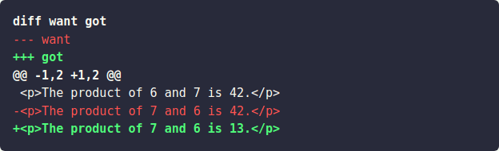

+++
title = "strings.Diff"
linkTitle = "Diff"
description = "以统一差异格式返回两段文本 OLD 与 NEW 的带锚点差异；两者完全相同时返回空字符串。"
date = 2026-10-02
weight = 85
source = "https://gohugo.io/functions/strings/diff/"

[params.functions_and_methods]
signatures = ["strings.Diff OLDNAME OLD NEWNAME NEW"]
returnType = "string"
+++

用 `strings.Diff` 比较两段字符串并渲染出带高亮的差异：

```go-html-template
{{ $want := `
<p>The product of 6 and 7 is 42.</p>
<p>The product of 7 and 6 is 42.</p>
`}}

{{ $got := `
<p>The product of 6 and 7 is 42.</p>
<p>The product of 7 and 6 is 13.</p>
`}}

{{ $diff := strings.Diff "want" $want "got" $got }}
{{ transform.Highlight $diff "diff" }}
```

渲染结果：


