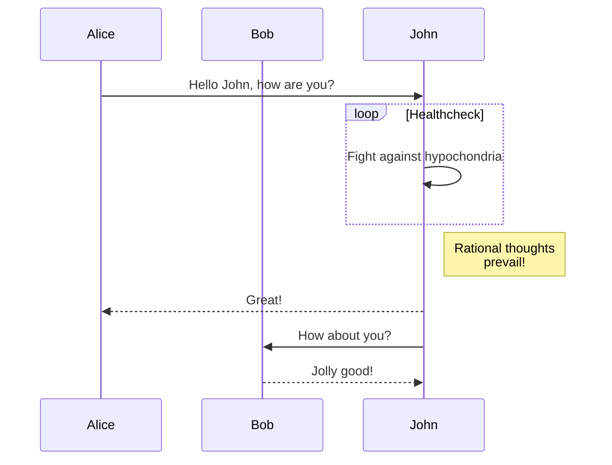

+++
title = "图表"
linkTitle = "图表"
description = "介绍 Hugo 中绘制图表的几种方案及其渲染时机与取舍。"
date = 2026-10-01
weight = 190
source = "https://gohugo.io/content-management/diagrams/"
+++

## 图表方案概览

在内容中插入图表大致有两条路线：一是构建期渲染（render at build time），由 Hugo 把图表描述直接转换成静态标记；二是浏览器端渲染（render in browser），页面先输出图表源码，再由加载的 JavaScript 库把它画出来。Hugo 对前者中的 GoAT 提供了内置支持，对 Mermaid 之类则要由站点自己编写渲染钩子（render hook）来接管。两条路线的依赖、产物与适用场景都不相同。

## GoAT 图（ASCII）

Hugo 借助内置的代码块渲染钩子原生支持 GoAT 图。只要把围栏代码块的语言标识写为 `goat`，块内的 ASCII 内容就会在构建时被渲染成图形，无需任何 JavaScript，也不依赖本机安装额外程序：

````markdown
```goat
      .               .                .               .--- 1          .-- 1     / 1
     / \              |                |           .---+            .-+         +
    /   \         .---+---.         .--+--.        |   '--- 2      |   '-- 2   / \ 2
   +     +        |       |        |       |    ---+            ---+          +
  / \   / \     .-+-.   .-+-.     .+.     .+.      |   .--- 3      |   .-- 3   \ / 3
 /   \ /   \    |   |   |   |    |   |   |   |     '---+            '-+         +
 1   2 3   4    1   2   3   4    1   2   3   4         '--- 4          '-- 4     \ 4
```
````

借助 GoAT 可以画出流程图、结构图、文件树、时序图、表格等多类图形，示例可参考 GoAT 项目本身的展示。这种方案只用文本字符构图，适合表达简单的流程与层级关系；线条密集的复杂图仍以专用绘图语言更省力。

## Mermaid 图

Hugo 没有为 Mermaid 提供内置模板，需要自己按语言编写代码块渲染钩子。把下面这个模板保存为 `layouts/_markup/render-codeblock-mermaid.html`：

```go-html-template
<pre class="mermaid">
  {{ .Inner | htmlEscape | safeHTML }}
</pre>
{{ .Page.Store.Set "hasMermaid" true }}
```

模板在渲染图表容器时顺手在页面存储（page store）里打了一个标记，之后在基础模板（base template）的 `body` 结束标签之前按需加载脚本：

```go-html-template
{{ if .Store.Get "hasMermaid" }}
  <script type="module">
    import mermaid from 'https://cdn.jsdelivr.net/npm/mermaid/dist/mermaid.esm.min.mjs';
    mermaid.initialize({ startOnLoad: true });
  </script>
{{ end }}
```

做好这些准备后，内容里就可以直接用 `mermaid` 语言标识的围栏代码块：

````markdown

````

渲染钩子内部的 `.Inner` 是代码块的原始内容，因此要用 `htmlEscape` 处理后再交给 `safeHTML` 输出，避免图表源码里的尖括号被当作标签解析。同理，图表定义必须留在围栏代码块中，否则 Markdown 解析器会先改写它的内容。

## 样式与尺寸

GoAT 图的围栏代码块同样接受 Markdown 属性，可以按需指定宽度、配色或类名：

````markdown
```goat {width=300 color="orange"}
───Linux─┬─Android
         ├─Debian─┬─Ubuntu─┬─Lubuntu
         │        └─Mint
         └─Fedora
```
````

Mermaid 图的尺寸与配色则在站点自己的样式表里定义，常用的做法是给 `.mermaid` 类设置 `max-width` 或主题变量。

## 方案取舍

| 方案 | 渲染时机 | 依赖 | 适用场景 |
| --- | --- | --- | --- |
| GoAT | 构建期 | 无 | 简单的 ASCII 风格图、结构图与流程图 |
| Mermaid | 浏览器端 | 站点引入 JavaScript | 流程图、时序图、状态图等 |

构建期渲染的产物是静态文件，页面无需执行脚本，对搜索引擎与纯文本阅读器更友好，代价是图形表达能力受描述语言限制；浏览器端渲染更灵活，但依赖访问者的浏览器，脚本加载失败时页面上只会剩下图表源码。选择方案时，先确定图表复杂度与部署环境可以接受的依赖，再决定渲染时机。

## 相关主题

- [内容管理](/content-management/)
- [渲染钩子](/render-hooks/)
- [页面资源](/content-management/page-resources/)
